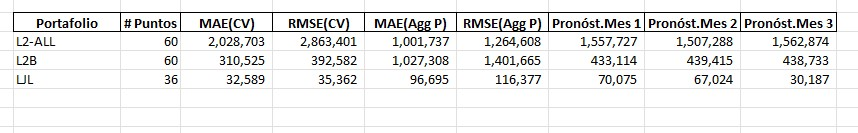
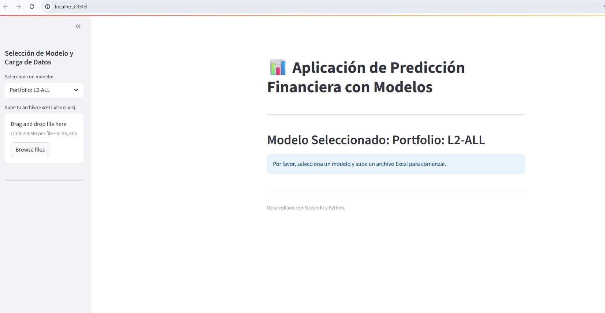

### Curso : Proyecto de Investigación II
#### Integrante: 
    * Diego Fernandez A.  
---


# Pronostico Financiero de Portafolio de Propiedades en Real Estate

 Proyecto de Investigacion en **Machine Learning** para entrenar una red neuronal recurrente(RNN), basado en LSTM(Long Short-Term Memory), con la finalidad que entrene un modelo que procesa la informacion historica de los libros contables y poder generar un pronostico de "n" meses por cada portafolio de propiedades.

 
 
## Estructura del repositorio

```
FINANCEV1/
├─ data/
│  ├─ raw/                  # datos fuente  
│  ├─ processed/            # dataset final para modelado (csv)
├─ models/
│  ├─ lstm_entity_1.0_p1.0.keras  
│  ├─ lstm_entity_3.0_p3.0.keras  
│  ├─ lstm_entity_4.0_p4.0.keras 
├─ notebooks/
│  ├─ 01_INGESTA DATA.ipynb
│  ├─ 02_EDA PORTFOLIO-PROPERTY.ipynb
│  ├─ 03_EDA PROPERTYDATA.ipynb
│  ├─ 04-EDA GENERAL LEDGER.ipynb
│  ├─ 05-EDA GENERAL LEDGER NET INCOME.ipynb
│  ├─ 06-EDA GENERAL LEDGER NET INCOME.ipynb
│  └─ 07-ENTRENAMIENTO MODELO RNN-LSTM.ipynb
│  └─ 08-EDA & ACCIONABLES GL P&L.ipynb 
├─ logs/
│  ├─ 01-log_ingesta_data.log
│  ├─ 02_eda_basic_propertydata.log
│  ├─ 03-eda_PROPERTY_DATA.log
│  ├─ 04-eda_GENERAL_LEDGER.log
│  ├─ 05-eda_general_ledger_netincome.log
│  ├─ 06-eda_general_ledger_netincome.log
│  ├─ 07-entrenamiento_lstm.log
├─ reports/
│  └─ result_lstm/
│     ├─ forecast_portfolio_1.0_accumulated.png
│     ├─ forecast_portfolio_3.0_accumulated.png
│     ├─ forecast_portfolio_4.0_accumulated.png
│     ├─ 0SUMMARY_RESULTS_PORTFOLIO_LSTM_EPOCH100.xlsx
├─ src/
│  ├─ api/                  # FastAPI para servir el modelo
│  ├─ config/ data/ features/ models/ utils/  # módulos auxiliares
├─ README.md
└─ requirements.txt
```

---

## Objetivo

- **Problema:** Procesar la informacion contable de cada empresa y agruparlas por portafolio de inversion, para la generar el pronostico de NetIncome mensual de un determinado n meses.
- **Alcance:** En la versión actual esta considerando el entrenamiento sobre la informacion generado por cada empresa / portafolio .
- **Dataset actual:** `data/processed/PROCESSED_GL_DATA_ALL_P_L_ANNUAL_MONTHLY_PER_ENTERPRISEV6.csv`.

---

## Reproducibilidad

### 1) Construcción del dataset 
Ejecutar notebooks en orden:

1. `01_INGESTA DATA.ipynb` – Ingestas y Procesamiento de datos ,Union de Dataset Portafolio + Propiedades.  
2. `02_EDA PORTFOLIO-PROPERTY.ipynb` – Analisis de los datos del Portafolio - Propiedad, generando imagenes.  
3. `03_EDA PROPERTYDATA.ipynb` – Analisis de los datos del Propiedad, generando imagenes.  
4. `04-EDA GENERAL LEDGER.ipynb` – Analisis de los datos del Portafolio - Propiedad - General Ledger, generando imagenes.  
5. `05-EDA GENERAL LEDGER NET INCOME.ipynb` – Analisis de los datos del  Portafolio - Propiedad - General Ledger por Entidad, generando imagenes.  
6. `06-EDA GENERAL LEDGER NET INCOME.ipynb` – Analisis de los datos del  Portafolio - Propiedad - General Ledger por Portafolio, generando imagenes.  
6. `08-EDA & ACCIONABLES GL P&L.ipynb` – genera un flujo de trabajo para visulizar las conclusiones accionables obtenidas del EDA, enfocado en el analisis de negocio o modelado predictivo.  


### 2) Entrenamiento y evaluación
`07-ENTRENAMIENTO MODELO RNN-LSTM.ipynb` utilizando un RNN basado en un modelo (**LSTM**) con **RMSE CV (5 folds)**, calcula **umbral óptimo por MAE**, y guarda:
- `models/lstm_entity_1.0_p1.0.keras`  

---


## Métricas y gráficos

- **Validación:** **RMSE** (adecuada para desbalance), además de MAE.
- **Holdout:** 80/20 estratificado.
- **Figuras generadas** (ver `reports/result_lstm/`):
  - `forecast_portfolio_1.0_accumulated.png` – Pronostico Acumulado de Net Income Para el Portafolio L2-All.  
  - `forecast_portfolio_3.0_accumulated.png` – Pronostico Acumulado de Net Income Para el Portafolio L2B.  
  - `forecast_portfolio_4.0_accumulated.png` – Pronostico Acumulado de Net Income Para el Portafolio LJL.  
  - `SUMMARY_RESULTS_PORTFOLIO_LSTM_EPOCH300.xlsx` – Resultado del proceso de entranmiento con n meses de pronostico.  
---
  


---

## 🚀 API (serving)

Ejecuta la API con **Streamlit** (en `http://localhost:8503/`):

```bash
 streamlit run app.py
```
  - Usa `models//lstm_entity_1.0_p1.0.keras` .
---

---


## 📓 Notas de datos

- **Claves:**  
  - Portafolio: `PORTFOLIOID`.  
  - Empresa: `ENTREPRISEID` / `ENTITYADMINID`.  
  - Propiedad: `PROPERTYID`.  
- **Prevención de fuga (leakage):** del entrenamiento se excluyen `PURCHASE_DATE`, `PURCHASE_PRICE`, `STATUS`, `ADDRESSPROYECTO_RIESGO_DESC` y **todas las llaves**.
---

## ✅ Checklist del asesor

- [x] Repositorio con carpetas mínimas (`data/raw`, `notebooks`, `src/`).  
- [x] Dataset definido y disponible en `data/processed`.  
- [x] Notebooks reproducibles: **ingesta** y **preprocesamiento** con **logs**.  
- [x] EDA y **gráficos** en cada notebooks.  
- [x] Baseline mínimo: comparación de modelos por **RMSE**, umbral óptimo, **pipeline** y **metadatos** guardados.  
- [x] API lista para demo interna.

---

## 📌 Roadmap corto

1. Aumentar los ratios Financieros, para complementar el entrenamiento.  
2. Implementacion en Docker para despliegue.  

---

## 📜  Créditos

Proyecto de tesis de maestría: **Pronostico Financiero de Portafolio de Inversion en Real Estate**.  

