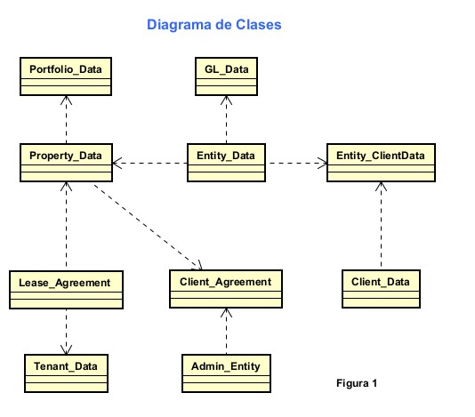

# Pronostico Financiero de Portafolio de Inversion

Proyecto de Investigacion en **Machine Learning** para entrenar una rede neuronal recurrente(RNN), basado en LSTM( Red de Memoria a Corto y Largo Plazo (en inglés, Long Short-Term Memory), generarn un pronostico para los siguiente 6 meses.





### Curso : Proyecto de Investigación II
#### Integrante: 
    Diego Fernandez.  
---

## Estructura del repositorio

```
FINANCEV1/
├─ data/
│  ├─ raw/                  # datos fuente (solo lectura)
│  ├─ interim/              # intermedios/temporales
│  ├─ processed/            # dataset final para modelado (parquet)
├─ models/
│  ├─ pipeline_lstm.pkl          # pipeline sklearn (preprocesamiento + modelo)
│  └─ pipeline_meta.json    # metadatos (columnas, umbral, scores CV)
├─ notebooks/
│  ├─ 01_Ingesta_data.ipynb
│  ├─ 02_EDA basico.ipynb
│  ├─ 03_EDA basico propertydata fullipynb
│  ├─ 04-EDA basico GL Full.ipynb
│  ├─ 05-EDA basico GL Net Income.ipynb
│  └─ 06-Entrenamiento modelo LSTM.ipynb
├─ reports/
│  └─ figures/
│     ├─ 01_figura.png
│     ├─ 02_figura.png
│     ├─ 03_figura.png
│     ├─ 04_figura.png
│     └─ 05_figura.png
├─ scripts/
│  ├─ ingest.py             # ingesta con hash y logging
│  └─ preprocess.py         # limpieza mínima y verificación de processed
├─ src/
│  ├─ api/                  # FastAPI para servir el modelo
│  ├─ config/ data/ features/ models/ utils/  # módulos auxiliares
├─ tests/
├─ .env / .env.example
├─ README.md
└─ requirements.txt
```

---

## Objetivo

- **Problema:** procesar la informacion contable de cada portafolio de inversion, para la generacion de los pronosticos.
- **Target:** En la versión actual esta considerando el entrenamiento sobre la informacion generado por cada empresa / portafolio .
- **Dataset actual:** `data/processed/dataset_portafolio_anual.parquet`.

---

## Reproducibilidad

### 1) Ingesta (copia a `data/raw/` + hash + log)
```bash
python scripts/ingest.py "C:/ruta/DS_DASH_Obra_1A.csv"
# salida: data/datasets.json (registro) y logs/ingest.log
```

### 2) Preprocesamiento mínimo (verificación y limpieza básica)
```bash
python scripts/preprocess.py
# salida: data/processed/dataset_obras.parquet y logs/preprocess.log
```

### 3) Construcción del dataset maestro
Ejecutar notebooks en orden:

1. `01_exploracion_diccionarios.ipynb` – mapeo/estandarización de campos.  
2. `02_construir_dataset_maestro_final.ipynb` – unión Obra+Empresa+Miembro, etiquetado desde Matriz, limpieza y export a parquet (`dataset_obras.parquet`).  
3. `EDA_baseline.ipynb` – genera figuras en `reports/figures/`.

### 4) Entrenamiento y evaluación
`06-Entrenamiento modelo LSTM.ipynb` utilizando un RNN , utilizando el modelo basado en (**LSTM**) con **RMSE CV (5 folds)**, calcula **umbral óptimo por F1**, y guarda:

- `models/pipeline_lstm.pkl`  
- `models/pipeline_meta.json` (columnas, RMSE por modelo, `best_threshold_f1`)

---

## Métricas y gráficos

- **Validación:** **RMSE** (adecuada para desbalance), además de ROC-AUC y `classification_report`.
- **Holdout:** 80/20 estratificado.
- **Figuras generadas** (ver `reports/figures/`):
  - `01_target.png` – distribución del target.  
  - `02_missing.png` – nulos por columna (Top 20).  
  - `03_importance.png` – *permutation importance* (índices transformados).  
  - `04_corr.png` – matriz de correlación numérica.  
  - `05_top.png` – top categorías (ej. `SECTOR`).

---

## 🚀 API (serving)

Ejecuta la API con **FastAPI** (en `src/api/`):

```bash
uvicorn src.api.main:app --reload
```

- `POST /predict_proba` → `{ proba, threshold, riesgoso }`
  - Usa `models/pipeline.pkl` y `best_threshold_f1` de `models/pipeline_meta.json`.
- Importante: el JSON de entrada debe incluir **las mismas columnas** que espera el pipeline (nombres como en el parquet).

---

## ⚙️ Entorno

```bash
python -m venv .venv
# Windows:
.venv\Scripts\activate
# Linux/Mac:
# source .venv/bin/activate

pip install -r requirements.txt
```

Variables opcionales en `.env` (ver `.env.example`).

---

## 📓 Notas de datos

- **Claves:**  
  - Portafolio: `PORTFOLIOID`.  
  - Empresa: `ENTREPRISEID` / `ENTITYADMINID`.  
  - Propiedad: `PROPERTYID`.  
  

- **Prevención de fuga (leakage):** del entrenamiento se excluyen `PURCHASE_DATE`, `PURCHASE_PRICE`, `STATUS`, `ADDRESSPROYECTO_RIESGO_DESC` y **todas las llaves**.

---

## ✅ Checklist del asesor

- [x] Repositorio con carpetas mínimas (`data/raw`, `notebooks`, `src/`).  
- [x] Dataset definido y disponible en `data/processed`.  
- [x] Scripts reproducibles: **ingesta** y **preprocesamiento** con **logs** y **hash**.  
- [x] EDA y **gráficos** en `reports/figures/`.  
- [x] Baseline mínimo: comparación de modelos por **RMSE**, umbral óptimo, **pipeline** y **metadatos** guardados.  
- [x] API lista para demo interna.

---

## 📌 Roadmap corto

1. Aumentar los ratios Financieros, para complementar el entrenamiento.  
2. Orquestación (Makefile/DVC) y Docker para despliegue.  

---

## 📜  Créditos

Proyecto de tesis de maestría: **Pronostico Financiero de Portafolio de Inversion en Real Estate**.  

